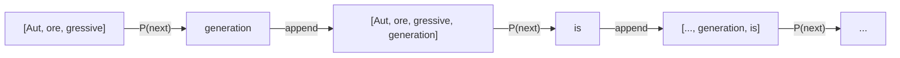
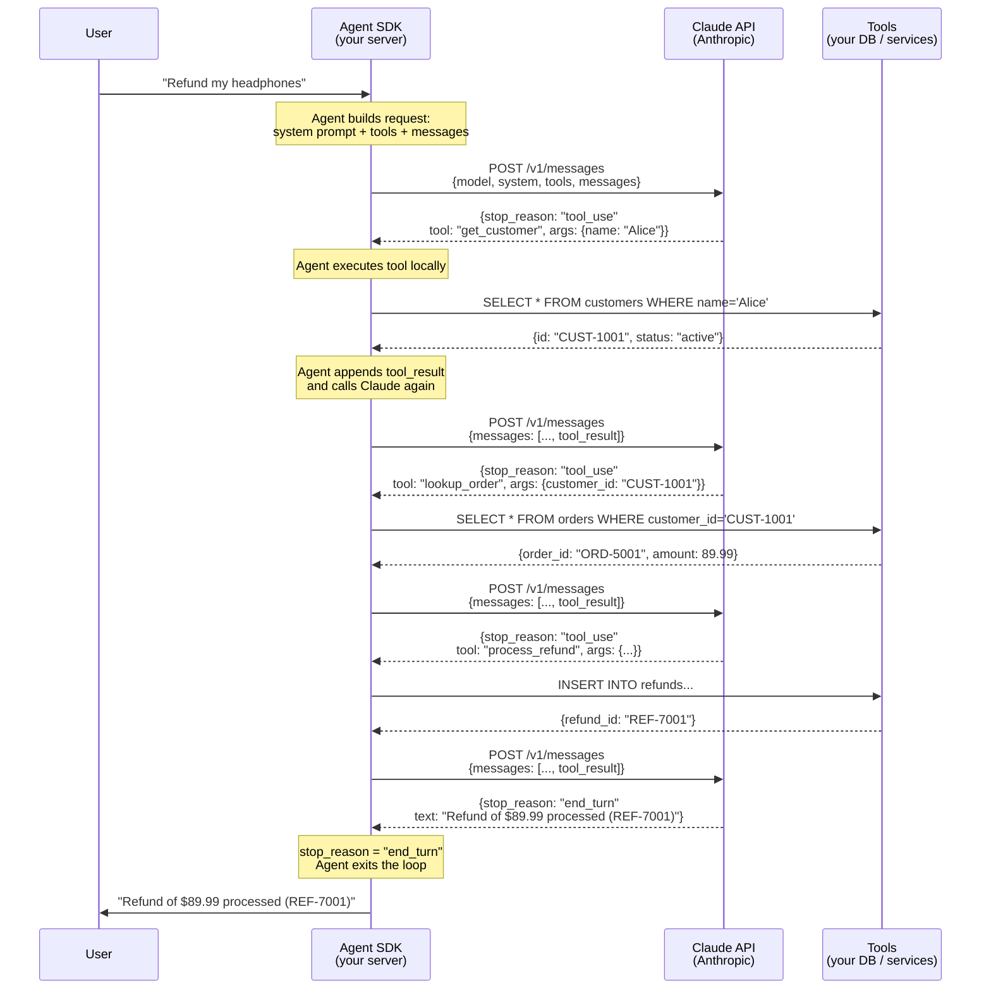

# How Claude and Agents Work

## LLM Fundamentals — How Claude Generates Output

Claude is a **large language model (LLM)** — an artificial neural network trained on massive text data. At its core, it generates text one token at a time using **autoregressive generation**.

### Token Generation Loop

Input text is split into tokens (subword units):

```
"Autoregressive generation is" → ["Aut", "ore", "gressive", " generation", " is", ...]
```

At each step, the model computes a probability distribution over the **next token** conditioned on all previous tokens, then samples (or selects) one, and repeats:

```
P(token_t | token_1, token_2, ..., token_{t-1})
```



This continues until the model produces a **stop token** (`end_turn`) or hits the max token limit. Every response — whether a simple answer or a complex tool call — is generated through this same loop.

### Single LLM Limitations

A single Claude call has inherent constraints:

| Limitation | Impact |
|-----------|--------|
| **One context window = one perspective** | Single reasoning chain, no parallel exploration |
| **Context degradation on long tasks** | Lost details, hallucinations as context fills up |
| **No parallelism** | Can't work on independent subtasks simultaneously |
| **Single failure mode** | One bad reasoning step can derail the entire output |

These limitations are why we need the **Agent pattern** — an orchestration layer that manages multiple Claude calls, maintains state, and executes tools.

---

## Two Layers That Make Tool Use Work

### Layer 1 — Training (done by Anthropic)

Claude was specifically trained on data that includes structured tool interactions. This taught the model to:

- Recognize when a user's request requires calling a tool
- Output structured JSON in the exact format needed (tool name, arguments)
- Interpret tool results and incorporate them into its response
- Chain multiple tool calls in the right order
- Know when to stop calling tools and give a final answer

This is baked into the model weights. A base LLM without this training would not reliably output structured tool calls — it would just generate freeform text.

| Trained ability | Example |
|-----------------|---------|
| **When** to call a tool | "refund my order" → needs `process_refund`, not just a text answer |
| **Which** tool to pick | Two similar tools → pick the right one based on description |
| **What** arguments to pass | Extract "Alice" from "I'm Alice" → `{ "name": "Alice" }` |
| **How** to chain tools | Look up customer first, then orders, then process refund |
| **When to stop** | Got the refund confirmation → give final answer, don't call more tools |
| **How to recover** | Tool returned an error → read the error, try a different approach or escalate |

### Layer 2 — Runtime (your tool definitions)

At runtime, you describe your tools in the API request:

```json
{
  "tools": [
    {
      "name": "get_customer",
      "description": "Look up a customer by name or email",
      "input_schema": {
        "type": "object",
        "properties": {
          "name": { "type": "string" },
          "email": { "type": "string" }
        }
      }
    }
  ]
}
```

Claude sees these definitions **in context** and maps user intent to the right tool. No fine-tuning needed for your specific tools — the general tool-use ability transfers.

The **ability** to use tools is trained into the model. The **specific tools** you provide are given at runtime via the API. The Agent SDK just manages the loop of sending tool definitions, receiving tool calls, executing them, and sending results back.


## Agent SDK vs Claude API — Sequence Flow



The key insight: **Claude only decides**, the **Agent SDK executes**. Each tool call is a separate round-trip to the Claude API. The Agent SDK manages this loop — append tool results, call again, repeat until `stop_reason: "end_turn"`.

---