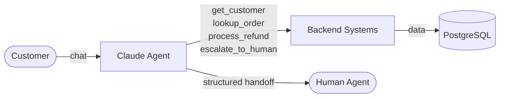
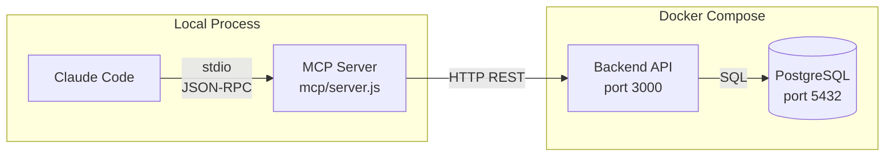
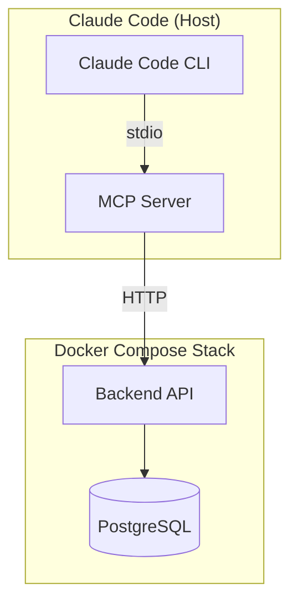
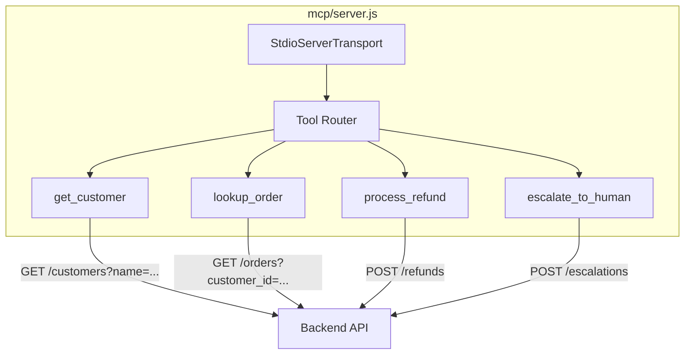
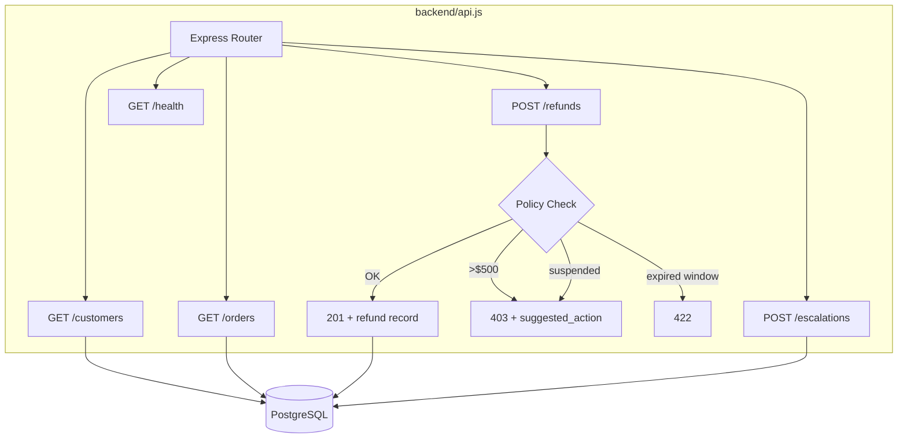
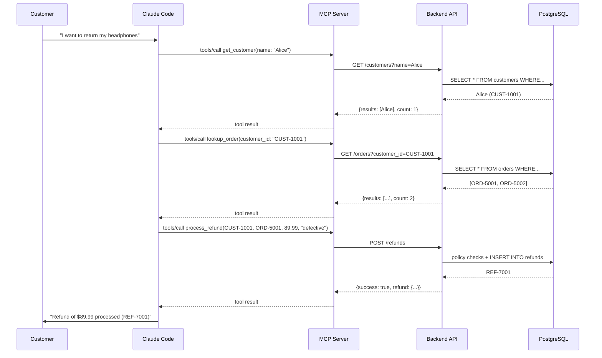
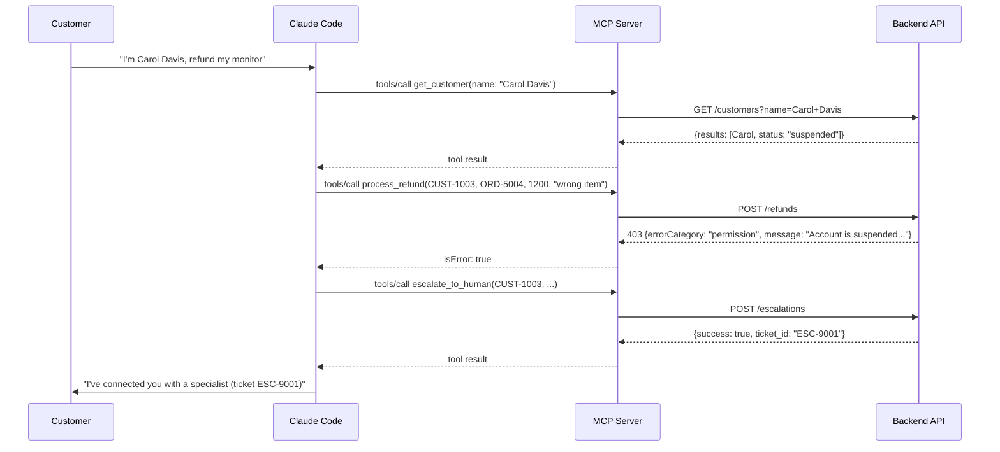
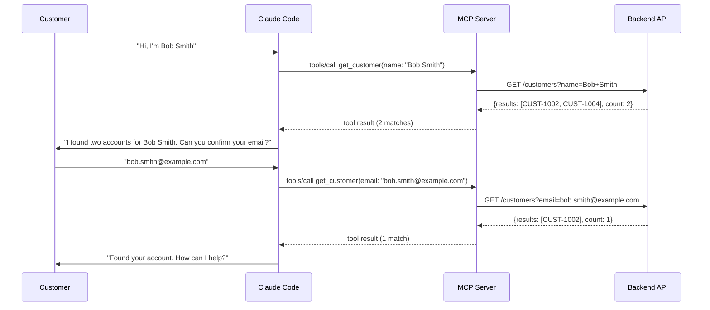
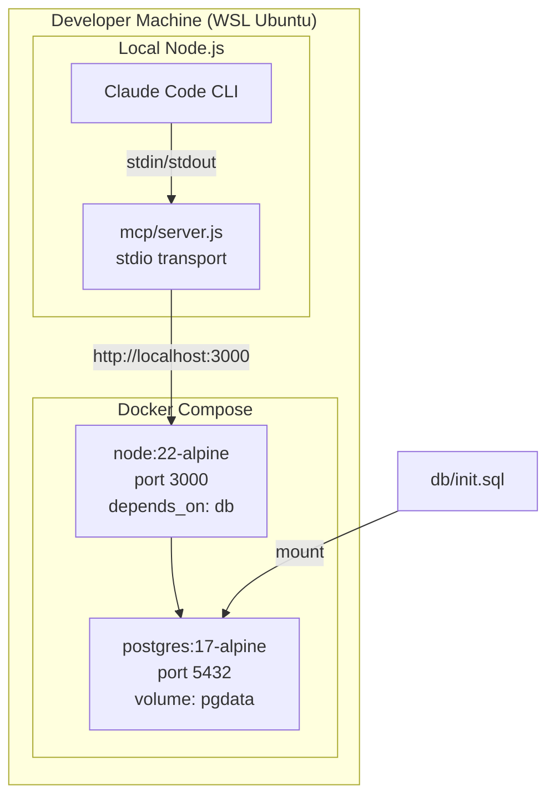

# Architecture: Customer Support Resolution Agent

Based on the [arc42](https://docs.arc42.org/home/) documentation template.

Common tech stack: [tech-stack.md](../../docs/tech-stack.md)

---

## 1. Introduction and Goals

### Requirements Overview

Build a customer support resolution agent using the Claude Agent SDK that handles high-ambiguity requests (returns, billing disputes, account issues) via MCP tools. Target: 80%+ first-contact resolution while knowing when to escalate.

### Quality Goals

| Priority | Goal          | Description                                                  |
|----------|---------------|--------------------------------------------------------------|
| 1        | Reliability   | Critical workflows (refunds) enforced programmatically       |
| 2        | Accuracy      | Agent disambiguates customers, never guesses                 |
| 3        | Safety        | Suspended accounts and high-value refunds escalate to humans |

### Stakeholders

| Role            | Concern                                    |
|-----------------|--------------------------------------------|
| Support agent   | Accurate handoff summaries when escalated  |
| Customer        | Fast resolution, correct refunds           |
| Developer       | Clear separation of MCP, API, and database |

---

## 2. Constraints

| Constraint          | Detail                                                    |
|---------------------|-----------------------------------------------------------|
| Refund auto-limit   | Max $500 without human approval                           |
| Return window       | 30 days from delivery                                     |
| Suspended accounts  | Cannot process refunds, must escalate                     |
| MCP transport       | stdio (local development), Streamable HTTP (production)   |
| Tech stack          | Next.js, PostgreSQL, Docker Compose (see tech-stack.md)   |

---

## 3. Context and Scope

### Business Context



### Technical Context



---

## 4. Solution Strategy

| Decision                        | Rationale                                                              |
|---------------------------------|------------------------------------------------------------------------|
| MCP server as thin bridge       | No business logic in MCP layer; all rules enforced server-side         |
| Programmatic enforcement        | Critical tool ordering (get_customer before refund) enforced in API    |
| Structured error responses      | API returns errorCategory, isRetryable, message for agent recovery     |
| stdio transport for dev         | Simplest local setup; no deployment needed                             |
| Seed data covers edge cases     | Duplicate names, suspended accounts, expired windows built into schema |

---

## 5. Building Block View

### Level 1 — System Overview



### Level 2 — MCP Server Internals



### Level 2 — Backend API Internals



---

## 6. Runtime View

### Scenario: Successful Refund



### Scenario: Escalation (Suspended Account)



### Scenario: Disambiguation (Duplicate Names)



---

## 7. Deployment View



### File Structure

```
Scenario-1/
├── .mcp.json                   # MCP server config (project-scoped)
├── docker-compose.yml          # PostgreSQL + API
├── package.json                # MCP server dependencies
├── mcp/
│   └── server.js               # MCP server (thin bridge)
├── backend/
│   ├── Dockerfile
│   ├── package.json            # express + pg
│   ├── api.js                  # REST API with business rules
│   └── db.js                   # PostgreSQL connection pool
├── db/
│   └── init.sql                # Schema + seed data
└── docs/
    └── architecture.md         # This file
```

---

## 8. Crosscutting Concepts

### Error Handling Strategy

All API errors return structured JSON with consistent fields:

```json
{
  "errorCategory": "validation | permission | transient",
  "isRetryable": false,
  "message": "Human-readable explanation",
  "customer_friendly": "Optional message safe to show the customer",
  "suggested_action": "Optional next step (e.g., escalate_to_human)"
}
```

The MCP server passes these through with `isError: true` so Claude can make informed recovery decisions.

### MCP Configuration Scopes

| Scope       | File              | Shared with team? |
|-------------|-------------------|--------------------|
| **Project** | `.mcp.json`       | Yes (version controlled) |
| **User**    | `~/.claude.json`  | No (personal only)       |

Project-scoped `.mcp.json` supports environment variable expansion (e.g., `${GITHUB_TOKEN}`) for credential management without committing secrets.

### MCP Transport Options

| Method              | Transport        | Use case                                              |
|---------------------|------------------|-------------------------------------------------------|
| **Command** (ours)  | stdio            | Local dev; Claude Code spawns it as a child process   |
| **Hosted endpoint** | Streamable HTTP  | Production; MCP server runs on a URL                  |

---

## 9. Architecture Decisions

| ID    | Decision                                    | Rationale                                                                |
|-------|---------------------------------------------|--------------------------------------------------------------------------|
| ADR-1 | MCP server does no business logic           | Single source of truth for rules in the API; MCP is replaceable          |
| ADR-2 | Programmatic enforcement over prompt-based  | Prompt instructions have non-zero failure rate for critical operations    |
| ADR-3 | Structured errors with categories           | Enables agent to distinguish retryable vs terminal failures              |
| ADR-4 | stdio transport for local dev               | Zero deployment overhead; switch to Streamable HTTP for production       |
| ADR-5 | Seed data covers all edge cases             | Ensures every policy branch is testable without manual data setup        |

---

## 10. Quality

### Quality Scenarios

| Scenario                                   | Expected Behavior                              | Metric               |
|--------------------------------------------|------------------------------------------------|----------------------|
| Customer requests refund under $500        | Auto-processed, confirmation returned          | < 3 tool calls       |
| Customer name matches multiple records     | Agent asks for disambiguation                  | Never guesses        |
| Refund > $500 requested                    | Blocked by API, agent escalates                | 100% enforcement     |
| Suspended account attempts refund          | Blocked by API, agent escalates                | 100% enforcement     |
| Backend API unreachable                    | MCP returns transient error, isRetryable: true | Agent can retry      |

---

## 11. Risks and Technical Debt

| Risk                                       | Mitigation                                            |
|--------------------------------------------|-------------------------------------------------------|
| Backend currently uses Express (not Next.js)| Planned migration to Next.js API routes               |
| In-memory refund ID generation (counter)   | Move to database sequence for production              |
| No authentication on API                   | Acceptable for local dev; add auth for production     |
| No rate limiting on MCP tools              | Add if exposing via Streamable HTTP                   |

---

## 12. Glossary

| Term                | Definition                                                                              |
|---------------------|-----------------------------------------------------------------------------------------|
| MCP                 | Model Context Protocol — standard for connecting AI agents to external tools and data    |
| stdio transport     | Communication over stdin/stdout between Claude Code and MCP server (child process)       |
| Streamable HTTP     | HTTP-based MCP transport for hosted/remote MCP servers                                   |
| Tool schema         | JSON schema defining a tool's name, description, and input parameters                    |
| Agentic loop        | Cycle of: send prompt to Claude, inspect stop_reason, execute tools, return results      |
| Escalation          | Handing a case to a human agent with structured context                                  |
| Programmatic enforcement | Using code (hooks, API gates) to guarantee workflow rules, not relying on prompts   |
