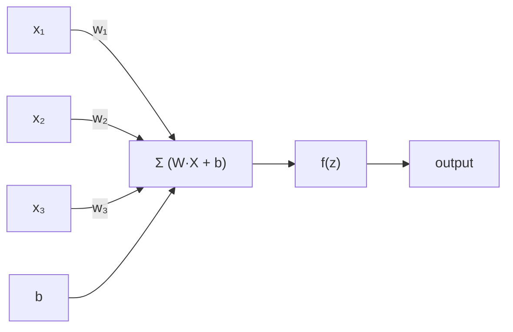
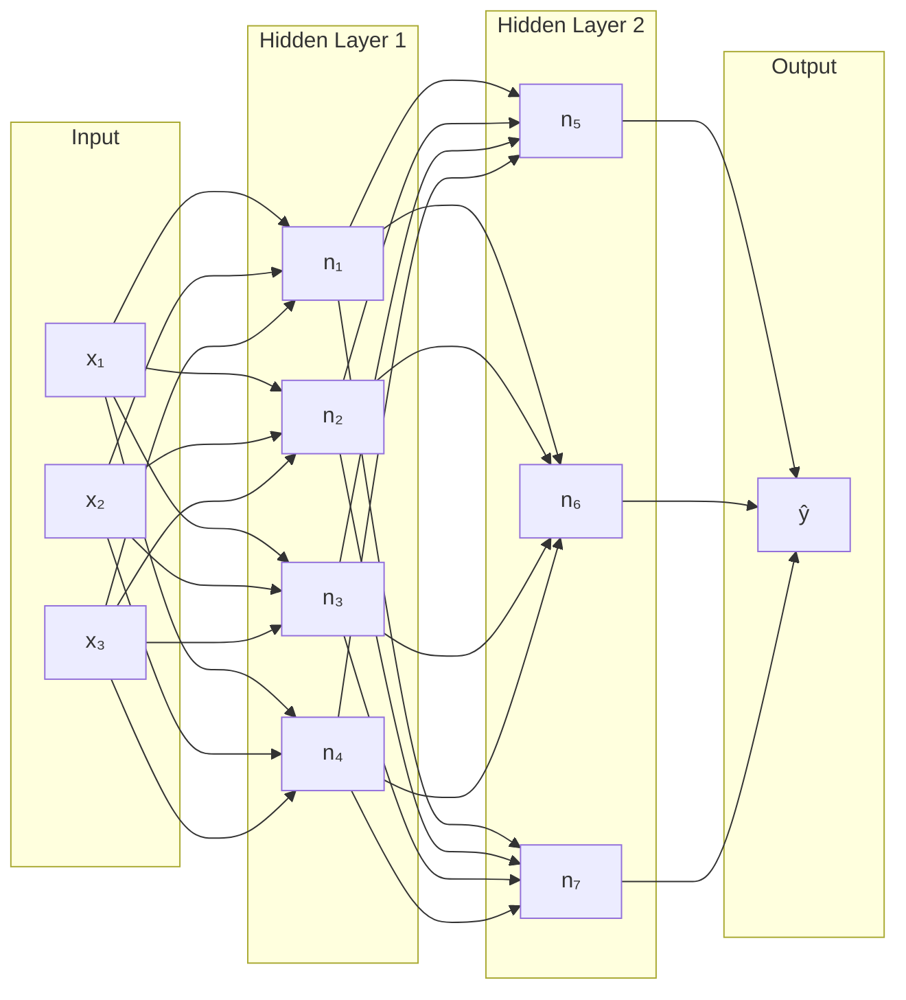
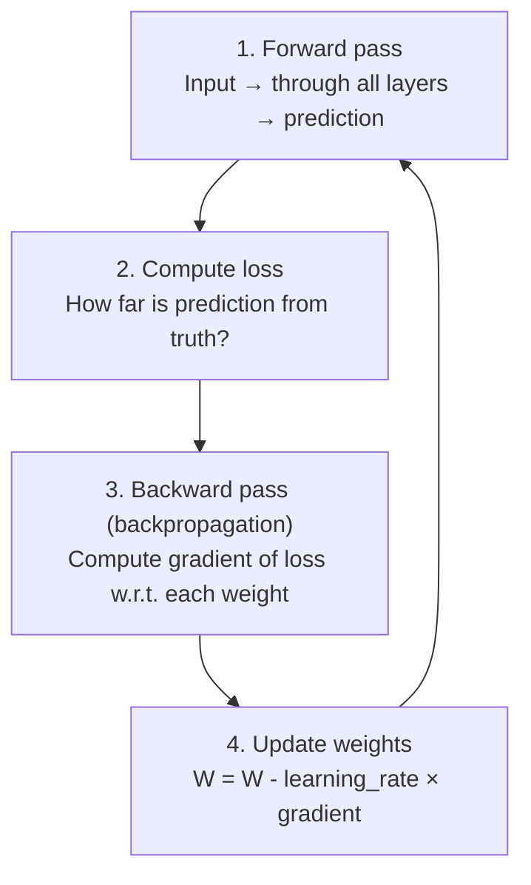
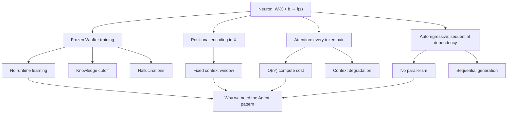

# Artificial Neural Network — Fundamentals

## Why This Matters

Before understanding LLMs, agents, or tool use, you need to understand what a neural network actually computes. Every AI system — from image classifiers to Claude — is built on the same foundational unit: the **neuron**.

---

## The Single Neuron

A neuron is a mathematical function with two stages:

### Stage 1 — Linear Transformation

```
z = w₁x₁ + w₂x₂ + ... + wₙxₙ + b
```

Or in vector notation:

```
z = W · X + b
```

| Symbol | Meaning |
|--------|---------|
| **X** = (x₁, x₂, ..., xₙ) | Input values (features) |
| **W** = (w₁, w₂, ..., wₙ) | Weights — learned parameters that determine how much each input matters |
| **b** | Bias — a learned offset that shifts the decision boundary |
| **z** | Pre-activation value — just a weighted sum |

This is a **linear function**: it can only model straight-line relationships. A network of purely linear neurons would collapse into a single linear transformation, no matter how many layers you stack.

### Stage 2 — Activation Function

```
output = f(z)
```

The activation function **introduces non-linearity**, allowing the network to model curves, boundaries, and complex patterns.

Common activation functions:

| Function | Formula | Used For |
|----------|---------|----------|
| **ReLU** | f(z) = max(0, z) | Hidden layers (most common) |
| **Sigmoid** | f(z) = 1 / (1 + e⁻ᶻ) | Binary output (probability 0–1) |
| **Tanh** | f(z) = (eᶻ - e⁻ᶻ) / (eᶻ + e⁻ᶻ) | Hidden layers (output range -1 to 1) |
| **Softmax** | f(zᵢ) = eᶻⁱ / Σeᶻʲ | Output layer (probability distribution over classes) |

### The Complete Neuron

```
input → [linear: W·X + b] → [activation: f(z)] → output
```



This is the atomic unit. Everything else — layers, networks, transformers — is composition of this.

---

## From Neurons to Networks

### Layers

Neurons are organized into layers. Each neuron in a layer receives input from the previous layer and sends output to the next.

```
Input Layer → Hidden Layer(s) → Output Layer
```



| Term | Meaning |
|------|---------|
| **Input layer** | Raw features (pixels, token embeddings, sensor readings) |
| **Hidden layers** | Intermediate representations — the network learns these |
| **Output layer** | Final prediction (a class, a probability, a next token) |
| **Deep network** | A network with many hidden layers (hence "deep learning") |

### Why Depth Matters

Each layer learns increasingly abstract representations:

```
Layer 1: edges, simple patterns
Layer 2: shapes, combinations of edges
Layer 3: objects, combinations of shapes
...
Layer N: high-level concepts
```

This hierarchical feature extraction is what makes deep networks powerful — they can learn representations that no human would think to engineer by hand.

---

## How the Network Learns

The weights (W) and biases (b) start random. The network learns by adjusting them to minimize a **loss function** — a measure of how wrong the predictions are.

### The Training Loop



| Step | What Happens |
|------|-------------|
| **Forward pass** | Data flows through the network, each neuron computes W·X + b then f(z) |
| **Loss computation** | Compare prediction to ground truth (e.g. cross-entropy for classification) |
| **Backpropagation** | Use the chain rule of calculus to compute how much each weight contributed to the error |
| **Weight update** | Nudge each weight in the direction that reduces the loss (gradient descent) |

### Gradient Descent — Intuition

Imagine standing on a hilly landscape blindfolded. You want to reach the lowest valley.

- The **loss** is your altitude
- The **gradient** tells you the slope under your feet
- You take a small step downhill (opposite to the gradient)
- **Learning rate** controls step size — too big and you overshoot, too small and you crawl

```
W_new = W_old - learning_rate × ∂Loss/∂W
```

This is repeated over thousands/millions of examples until the loss converges.

---

## Key Takeaways

| Concept | Why It Matters |
|---------|---------------|
| **Neuron = linear + activation** | The atomic building block — everything is composed from this |
| **Non-linearity is essential** | Without activation functions, stacking layers adds no power |
| **Depth = abstraction** | More layers = more abstract features learned automatically |
| **Learning = optimization** | Training adjusts weights to minimize prediction error via gradient descent |
| **Everything is differentiable** | The entire pipeline must support gradient computation — this constrains what architectures are possible |

This foundation applies to all neural networks. What makes an LLM different is **what** it learns (language patterns), **how** it's structured (transformer architecture with attention), and **how much** data and compute it trains on — but every individual computation still traces back to W·X + b → f(z).

---

## From ANN to LLM — How the Math Creates the Limitations

The limitations of LLMs (see [agent-mcp.md](agent-mcp.md#single-llm-limitations)) are not arbitrary design choices — they trace directly back to the neural network math above.

### Fixed Weights After Training

Once training is complete, all weights are **frozen**:

```
z = W·X + b    ← W and b are constants now
```

The model cannot update its own weights at inference time. This means:

| Consequence | Why |
|-------------|-----|
| **No learning from your conversation** | Weights don't change — it can't "remember" across sessions |
| **Knowledge cutoff** | Everything it knows was encoded into W during training |
| **Hallucinations** | The model computes the most probable next token from fixed weights — if the training data didn't cover it well, the output is a confident guess, not a lookup |

The agent pattern compensates: external memory, tool calls, and persistent state fill the gap that frozen weights create.

### Max Token Limit — Positional Encoding

An LLM needs to know **where** each token sits in the sequence. This is done through **positional encodings** — values added to token embeddings before they enter the network:

```
input_to_network = token_embedding + positional_encoding
```

The positional encoding is part of the input vector X in our neuron equation. The model was trained with positions up to a fixed maximum (e.g. position 0 to 199,999 for a 200K context model).

```
Position 0        → trained ✓ (model has seen this)
Position 100,000  → trained ✓
Position 200,000  → out of distribution ✗ (never seen during training)
```

Beyond the trained range, the positional values are **out of distribution** — the weights W were never optimized for these inputs. The linear transformation `W · X + b` produces unreliable outputs because X contains positional values the network has never encountered.

This is why there's a hard context window limit — it's not a software setting, it's a boundary of what the weights can handle.

### Attention Costs — O(n²) Compute

The transformer architecture (which LLMs use) includes an **attention mechanism** where every token attends to every other token. Each attention computation is a neuron-style operation:

```
Attention(Q, K, V) = softmax(Q · Kᵀ / √d) · V
```

Breaking this down in neuron terms:
- `Q · Kᵀ` — linear transformation (like W·X) between every pair of tokens
- `softmax(...)` — activation function (converts to probability distribution)
- `· V` — another linear transformation to produce output

For a sequence of **n** tokens, this requires computing attention scores for every token pair:

```
n tokens × n tokens = n² attention computations
```

| Sequence length | Attention operations | Relative cost |
|----------------|---------------------|---------------|
| 1,000 tokens | 1,000,000 | 1x |
| 10,000 tokens | 100,000,000 | 100x |
| 100,000 tokens | 10,000,000,000 | 10,000x |

This is why:
- **Longer contexts cost more** — compute and memory scale quadratically
- **Max tokens exist as a cost guard** — without a cap, a single response could consume enormous GPU resources
- **Context degradation occurs** — with many tokens, attention scores spread thin and the model struggles to focus on the most relevant parts ("lost in the middle" effect)

### No Parallelism in Generation

Autoregressive generation computes one token at a time:

```
token_t = f(W · [token_1, token_2, ..., token_{t-1}] + b)
```

Each token depends on **all previous tokens** as input X. You cannot compute token 5 before token 4 exists — it's a sequential dependency chain. This means:

- A single LLM call cannot work on two subtasks simultaneously
- Long outputs are inherently slow (each token waits for the previous one)

The agent pattern solves this by **spawning parallel subagents** — separate LLM calls that run concurrently, each with independent context.

### Summary — Limitations Traced to the Math



Every LLM limitation maps back to the properties of `W·X + b → f(z)` — the same neuron equation from the top of this document. The agent pattern (agentic loop, tool use, subagents, external memory) exists specifically to work around what the math cannot do on its own.
