# Human Brain vs ANN — Memory & Learning

> Based on *Learning How to Learn* by Barbara Oakley PhD (2018) and cognitive psychology fundamentals.
> Read [artificial-neural-network.md](artificial-neural-network.md) first for the ANN side.

---

## The Big Picture — Two Systems That "Learn" Differently

Both the human brain and an ANN take inputs, form internal representations, and produce outputs. But **how** they store and retrieve information is fundamentally different.

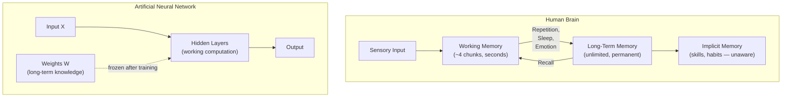

| Aspect | Human Brain | ANN |
|--------|------------|-----|
| **Short-term processing** | Working memory (~4 items) | Forward pass through layers (context window) |
| **Long-term storage** | Synaptic connections, strengthened over time | Weights W and biases b, set during training |
| **Can learn after "deployment"?** | Yes — always | No — weights are frozen after training |
| **Forgets?** | Yes — forgetting curve | No — but also can't update |
| **Unconscious knowledge?** | Yes — procedural/implicit memory | No — every computation is explicit |

---

## Working Memory — The Brain's "Context Window"

### What It Is

Working memory is your mental scratchpad. It holds the information you're **actively thinking about right now**. Cognitive psychologist George Miller originally said ~7 items, but modern research (Cowan, 2001) narrows it to **about 4 chunks**.

```
Working Memory ≈ 4 slots (chunks)
Duration: seconds to ~1 minute without rehearsal
```

### The ANN Equivalent

An LLM's **context window** is its working memory. Everything the model can "think about" must fit within the token limit.

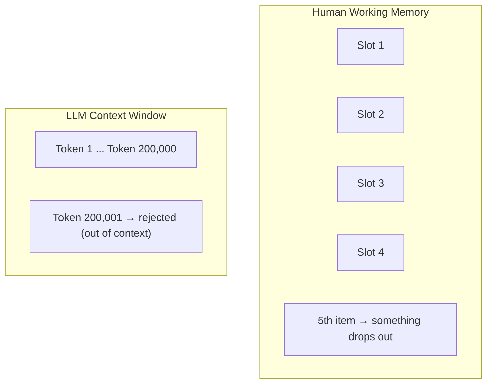

| Property | Human Working Memory | LLM Context Window |
|----------|--------------------|--------------------|
| **Capacity** | ~4 chunks | Fixed token limit (e.g. 200K) |
| **What happens at overflow** | Old items displaced (forgotten) | Input truncated or rejected |
| **Can expand capacity?** | Yes — through **chunking** | No — hard architectural limit |
| **Speed** | Slower with more items | Quadratically slower (O(n²) attention) |

### Chunking — How Humans Cheat the Limit

Barbara Oakley emphasizes **chunking** as the #1 learning strategy. A chunk is a group of information bound together through meaning or practice.

Example — remembering a phone number:

```
Raw:         0  4  1  2  3  4  5  6  7  8    → 10 items (overflows working memory)
Chunked:     041-234-5678                     → 3 chunks (fits easily)
```

Example — learning to drive:

```
Beginner:   [check mirror] [press clutch] [shift gear] [release clutch] [press gas]  → 5 separate items
Expert:     [shift gear]  → 1 automatic chunk
```

**This is why practice matters.** When you practice something enough, multiple steps collapse into a single chunk, freeing working memory for higher-level thinking.

> In ANN terms, chunking is like what happens in deeper layers — low-level features (edges, pixels) get composed into higher-level representations (shapes, objects). The difference: the brain does this dynamically; the ANN's representations are frozen after training.

---

## Where Memory Lives in the Brain

Working memory and long-term memory are not just different concepts — they are handled by **different physical parts** of the brain (*Psychology for Beginners*, Usborne).

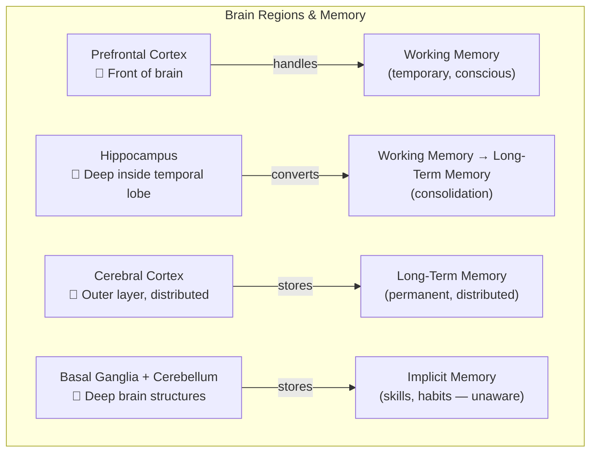

| Brain Region | Memory Role | Damage Consequence |
|-------------|-------------|-------------------|
| **Prefrontal cortex** | Working memory — holds & manipulates current information | Can't focus, can't hold instructions in mind |
| **Hippocampus** | Gateway to long-term memory — consolidates new conscious memories | Can't form **new** long-term memories (but old ones remain!) |
| **Cerebral cortex** (distributed) | Stores long-term declarative memories across many regions | Loss of specific knowledge depending on area damaged |
| **Basal ganglia & cerebellum** | Stores procedural/implicit memories (skills, habits) | Loss of motor skills, coordination |
| **Amygdala** | Tags memories with emotion — emotional memories consolidate faster | Reduced emotional memory, less fear learning |

### The Hippocampus — The Critical Gateway

The hippocampus is essential for **conscious (explicit) memory**. It acts as a temporary relay station:

```
New experience → Prefrontal cortex (working memory)
                      ↓
                 Hippocampus (consolidation — especially during sleep)
                      ↓
                 Cerebral cortex (permanent long-term storage)
```

**Famous case — Patient H.M.:** In 1953, Henry Molaison had his hippocampus surgically removed to treat epilepsy. The result:
- He could **not** form any new conscious memories (no new facts, no new events)
- He **could** still recall old memories from before surgery
- He **could** still learn new motor skills (procedural memory) — proving implicit memory uses a different brain system

This case proved that the hippocampus is required for forming new conscious memories but **not** for implicit/procedural memory (which uses the basal ganglia and cerebellum instead).

### Why This Matters for the ANN Comparison

An ANN has **no physical separation** between these functions. All computation runs through the same weights and layers. The brain's architecture is fundamentally modular — different memory types live in different hardware.

| Brain Architecture | ANN Architecture |
|-------------------|-----------------|
| Prefrontal cortex = working memory processor | Context window = all-purpose buffer |
| Hippocampus = consolidation engine | No equivalent — no ongoing consolidation |
| Cortex = distributed long-term storage | Weights = single unified storage |
| Basal ganglia = implicit memory system | No equivalent — no separate skill system |
| **Specialized regions for specialized memory** | **One architecture does everything** |

---

## Long-Term Memory — The Brain's "Weights"

### What It Is

Long-term memory is where the brain stores knowledge permanently. Unlike working memory, it has **virtually unlimited capacity** and can last a lifetime.

Getting information from working memory into long-term memory requires **consolidation** — and this is where most students fail.

### Two Types

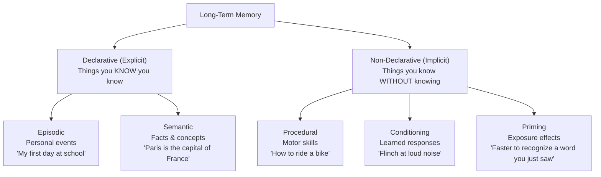

### The ANN Comparison

| Property | Human Long-Term Memory | ANN Weights |
|----------|----------------------|-------------|
| **Capacity** | Virtually unlimited | Fixed at architecture design (number of parameters) |
| **How it's formed** | Repeated activation strengthens synapses (Hebbian learning: "neurons that fire together wire together") | Gradient descent adjusts W to minimize loss |
| **Can update after "deployment"?** | Yes — learning never stops | No — weights frozen after training |
| **Retrieval** | Cue-dependent, associative, sometimes fails | Deterministic forward pass, always produces output |
| **Forgetting** | Yes — Ebbinghaus forgetting curve | No forgetting, but also no new learning |

### Key Insight From Oakley

> "Learning is creating a pattern of neural connections in long-term memory."

The brain's version of "training" is **repeated retrieval and use** of information, which strengthens synaptic connections — directly analogous to how gradient descent strengthens weights along useful pathways.

---

## Unaware Memory — What ANNs Cannot Do

### Procedural (Implicit) Memory

This is the most fascinating difference. Humans have knowledge they **cannot articulate or access consciously**:

- **Drawing skill** — You can draw a face, but you cannot explain the exact muscle movements
- **Riding a bike** — You know how, but try writing instructions for someone who has never done it
- **Native language grammar** — You know "the big red ball" sounds right and "the red big ball" sounds wrong, but most people cannot state the adjective-ordering rule (opinion-size-age-shape-color-origin-material-purpose)
- **Typing** — Look away from the keyboard: where is the letter "J"? Most fast typists cannot answer without moving their fingers

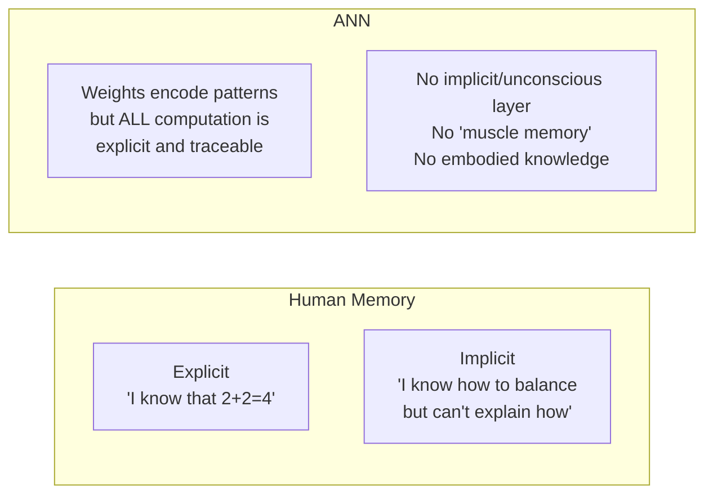

### Why This Matters for Learning

Oakley's key point: **you want to move knowledge from explicit to implicit.** When math operations become automatic (implicit), your working memory is freed for problem-solving. When reading becomes automatic, you can focus on comprehension.

```
Beginner reading:   [decode letter] [decode letter] [form word] [understand word]  → working memory full
Expert reading:     [understand sentence]  → most processing is implicit/automatic
```

This is exactly what an ANN **cannot** do — it has no mechanism to "automate" frequent patterns into a faster subsystem. Every forward pass computes the full chain `W·X + b -> f(z)` through all layers, every time.

---

## How to Improve Human Memory — Oakley's Strategies

### 1. Transform It (Encoding)

Don't just re-read. **Transform** information into a different form. This forces deeper processing.

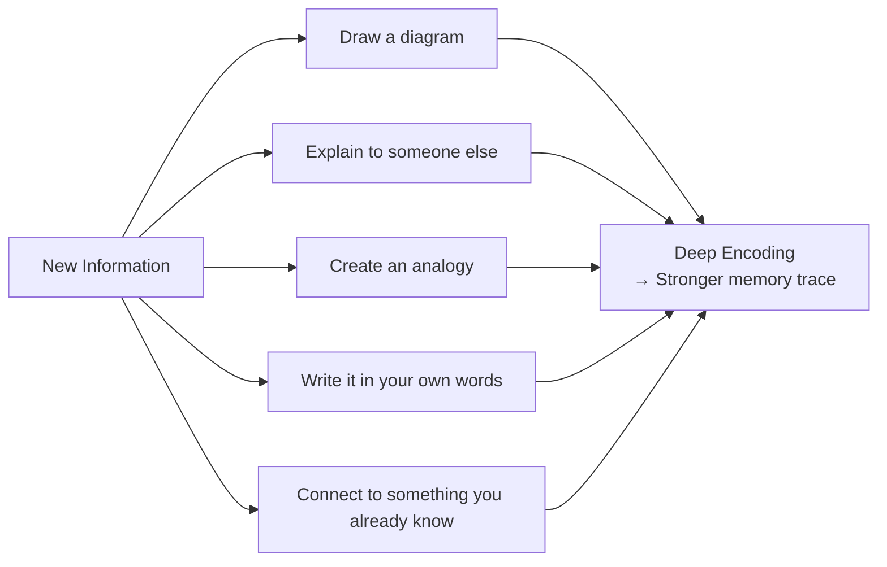

**Why it works:** Transformation activates multiple brain regions (visual, verbal, motor, emotional), creating more synaptic connections to the same memory. More connections = more retrieval cues = easier to remember.

| Weak Encoding | Strong Encoding |
|---------------|-----------------|
| Re-reading the textbook | Closing the book and drawing a concept map |
| Highlighting text | Writing a summary in your own words |
| Copying notes | Teaching the concept to a friend |
| Passive listening | Creating practice problems |

> **ANN analogy:** This is like data augmentation in training — showing the network the same concept from multiple angles (rotated images, paraphrased text) creates more robust weight patterns. The human version is self-directed.

### 2. Drink a Cup of Coffee (Arousal & Attention)

This one sounds trivial but has solid neuroscience behind it.

**Caffeine** blocks adenosine receptors in the brain. Adenosine normally accumulates during waking hours and makes you drowsy. Blocking it:

```
Caffeine → blocks adenosine → increases alertness
                             → improves attention
                             → enhances working memory capacity (slightly)
                             → better consolidation of new memories
```

**Optimal use (from research):**
- **200mg** (about 1 cup of brewed coffee) is the sweet spot
- **Timing matters**: drink it **during or right after** a study session, not before sleep
- Caffeine enhances **consolidation** — the process of moving info from working memory to long-term memory
- Diminishing returns: regular heavy use reduces the effect (tolerance)

> **ANN analogy:** There isn't a direct one, but the closest concept is **learning rate**. Too low (drowsy brain) and learning is slow. Too high (too much caffeine/anxiety) and you overshoot — you can't focus, you jitter. There's an optimal arousal level (Yerkes-Dodson law).

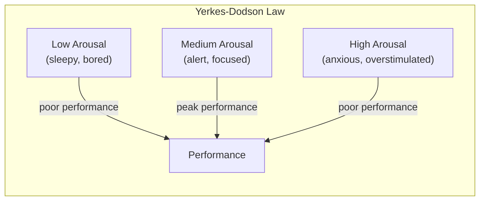

### 3. Recall (Active Retrieval Practice)

This is Oakley's **most important** strategy. It's also the most counterintuitive.

**The testing effect:** Actively trying to retrieve information from memory strengthens the memory far more than re-studying the material.

```
Re-reading:     Information → Eyes → Short-term buffer → fades
Active recall:  [Close book] → Try to remember → Struggle → Retrieve → STRONGER memory
```

**Why struggling matters:** When you try to recall and it's **hard**, the brain strengthens that retrieval pathway. Easy recall doesn't trigger the same consolidation. This is called **desirable difficulty**.

**Practical techniques:**
1. **Flashcards** — The classic. Flip, try to answer, check.
2. **Blank page method** — After reading a section, close the book. Write everything you remember on a blank page.
3. **Self-testing** — Before looking at solutions, try to solve the problem yourself.
4. **Spaced retrieval** — Test yourself at increasing intervals (1 day, 3 days, 7 days, 14 days).

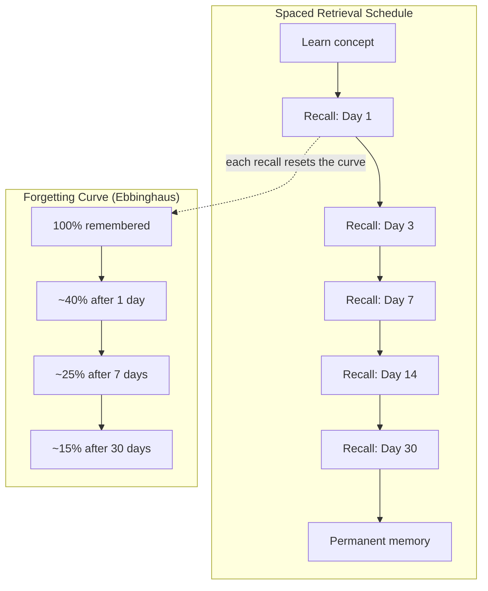

> **ANN analogy:** Active recall is like **training epochs**. The ANN doesn't learn by being shown data passively — it learns by making predictions (forward pass), checking errors (loss), and updating (backprop). Each recall attempt is the brain's version of a training step. Re-reading is like feeding data through a network with a learning rate of zero — the data passes through but nothing changes.

---

## Oakley's Two Modes of Thinking

A central concept in *Learning How to Learn*:

### Focused Mode vs Diffuse Mode

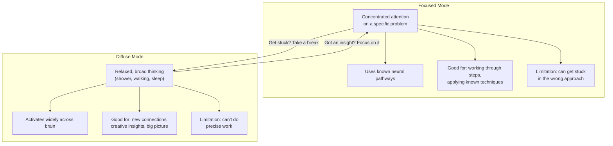

| Property | Focused Mode | Diffuse Mode |
|----------|-------------|-------------|
| **Attention** | Narrow, concentrated | Wide, relaxed |
| **When active** | Studying, problem-solving | Walking, showering, sleeping |
| **Neural activity** | Tight, established pathways | Broad, random connections |
| **Good for** | Executing known methods | Finding new approaches |
| **Analogy** | Pinball with tight bumpers | Pinball with wide bumpers |

**Oakley's advice:** Alternate between the two. Study hard (focused), then take a break or sleep (diffuse). The breakthrough often comes during the diffuse phase.

### The ANN Comparison

ANNs have **no diffuse mode**. They are always in "focused mode" — running the same computation path through fixed weights. This is why:

- ANNs don't have "aha moments"
- ANNs can't step back and reconsider their approach mid-computation
- ANNs don't benefit from "sleeping on it" (though there's a technique called **dropout** during training that vaguely mimics some diffuse-mode properties by randomly deactivating neurons)

---

## Sleep — The Brain's Training Phase

Oakley emphasizes sleep as non-negotiable for learning.

### What Happens During Sleep

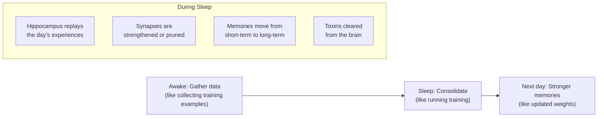

| Sleep Phase | What It Does | ANN Analogy |
|-------------|-------------|-------------|
| **Slow-wave sleep** | Consolidates declarative memories (facts) | Training on a dataset |
| **REM sleep** | Strengthens procedural memories (skills), creates creative connections | Fine-tuning + data augmentation |
| **Sleep spindles** | Transfer from hippocampus to cortex | Moving data from buffer to permanent storage |

> **This is the biggest difference from ANNs.** The brain does its actual "weight updating" (synaptic strengthening) primarily during sleep. An ANN trains in one continuous session. A human learns across cycles of experience and rest.

---

## Summary — Human Brain vs ANN Memory

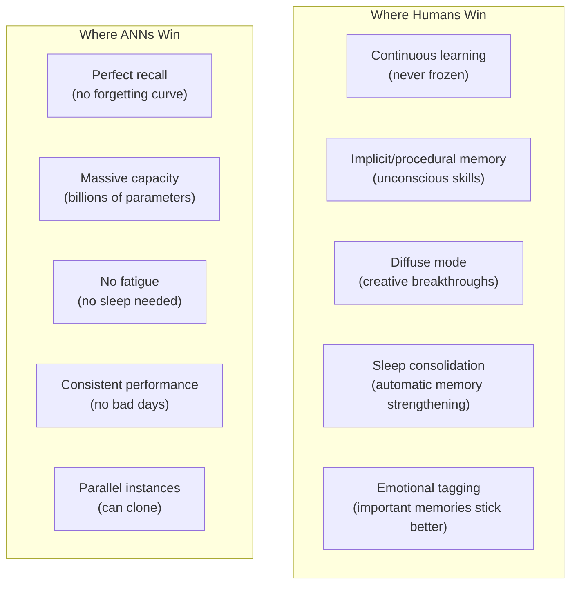

### Oakley's Core Message for Students

1. **Don't just re-read** — use active recall (the brain's version of training)
2. **Chunk information** — compress multiple items into single units (the brain's version of learned representations)
3. **Sleep** — your brain literally trains during sleep (the brain's offline training phase)
4. **Alternate focused and diffuse** — your brain has two modes; use both (ANNs only have one)
5. **Transform information** — encode through multiple channels (the brain's version of data augmentation)
6. **Space your practice** — distributed practice beats cramming (the brain's version of multiple training epochs with different data ordering)
7. **Coffee helps** — moderate caffeine improves attention and consolidation (the brain's learning rate optimizer)

---

## References

- Oakley, B. (2018). *Learning How to Learn: How to Succeed in School Without Spending All Your Time Studying; A Guide for Kids and Teens*. TarcherPerigee.
- Oakley, B. (2014). *A Mind for Numbers: How to Excel at Math and Science*. TarcherPerigee.
- Ebbinghaus, H. (1885). *Memory: A Contribution to Experimental Psychology*.
- Cowan, N. (2001). "The magical number 4 in short-term memory." *Behavioral and Brain Sciences*.
- Roediger, H. L., & Butler, A. C. (2011). "The critical role of retrieval practice in long-term retention." *Trends in Cognitive Sciences*.
- Yerkes, R. M., & Dodson, J. D. (1908). "The relation of strength of stimulus to rapidity of habit-formation."
