# Human Brain vs ANN — Memory & Learning

> Based on *Learning How to Learn* by Barbara Oakley PhD (2018) and cognitive psychology fundamentals.
> Read [artificial-neural-network.md](artificial-neural-network.md) first for the ANN side.

---

## The Big Picture — Two Systems That "Learn" Differently

Both the human brain and an ANN take inputs, form internal representations, and produce outputs. But **how** they store and retrieve information is fundamentally different.

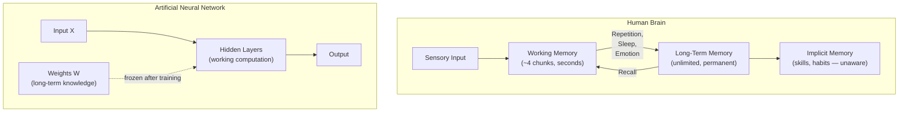

| Aspect | Human Brain | ANN |
|--------|------------|-----|
| **Short-term processing** | Working memory (~4 items) | Forward pass through layers (context window) |
| **Long-term storage** | Synaptic connections, strengthened over time | Weights W and biases b, set during training |
| **Can learn after "deployment"?** | Yes — always | No — weights are frozen after training |
| **Forgets?** | Yes — forgetting curve | No — but also can't update |
| **Unconscious knowledge?** | Yes — procedural/implicit memory | No — every computation is explicit |

---

## Working Memory — The Brain's "Context Window"

### What It Is

Working memory is your mental scratchpad. It holds the information you're **actively thinking about right now**. Cognitive psychologist George Miller originally said ~7 items, but modern research (Cowan, 2001) narrows it to **about 4 chunks**.

```
Working Memory ≈ 4 slots (chunks)
Duration: seconds to ~1 minute without rehearsal
```

### The ANN Equivalent

An LLM's **context window** is its working memory. Everything the model can "think about" must fit within the token limit.

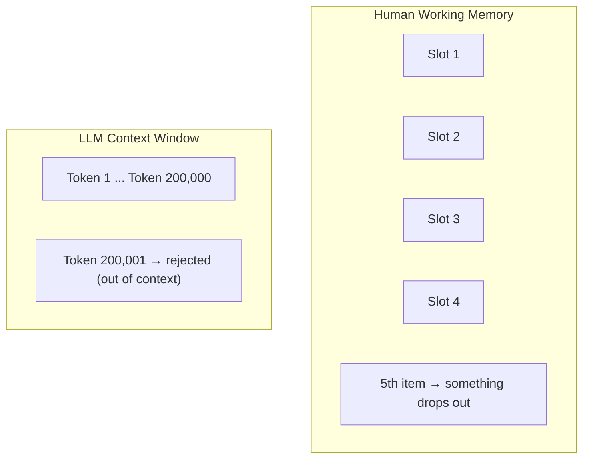

| Property | Human Working Memory | LLM Context Window |
|----------|--------------------|--------------------|
| **Capacity** | ~4 chunks | Fixed token limit (e.g. 200K) |
| **What happens at overflow** | Old items displaced (forgotten) | Input truncated or rejected |
| **Can expand capacity?** | Yes — through **chunking** | No — hard architectural limit |
| **Speed** | Slower with more items | Quadratically slower (O(n²) attention) |

### Chunking — How Humans Cheat the Limit

Barbara Oakley emphasizes **chunking** as the #1 learning strategy. A chunk is a group of information bound together through meaning or practice.

Example — remembering a phone number:

```
Raw:         0  4  1  2  3  4  5  6  7  8    → 10 items (overflows working memory)
Chunked:     041-234-5678                     → 3 chunks (fits easily)
```

Example — learning to drive:

```
Beginner:   [check mirror] [press clutch] [shift gear] [release clutch] [press gas]  → 5 separate items
Expert:     [shift gear]  → 1 automatic chunk
```

**This is why practice matters.** When you practice something enough, multiple steps collapse into a single chunk, freeing working memory for higher-level thinking.

> In ANN terms, chunking is like what happens in deeper layers — low-level features (edges, pixels) get composed into higher-level representations (shapes, objects). The difference: the brain does this dynamically; the ANN's representations are frozen after training.

---

## Where Memory Lives in the Brain

Working memory and long-term memory are not just different concepts — they are handled by **different physical parts** of the brain (*Psychology for Beginners*, Usborne).

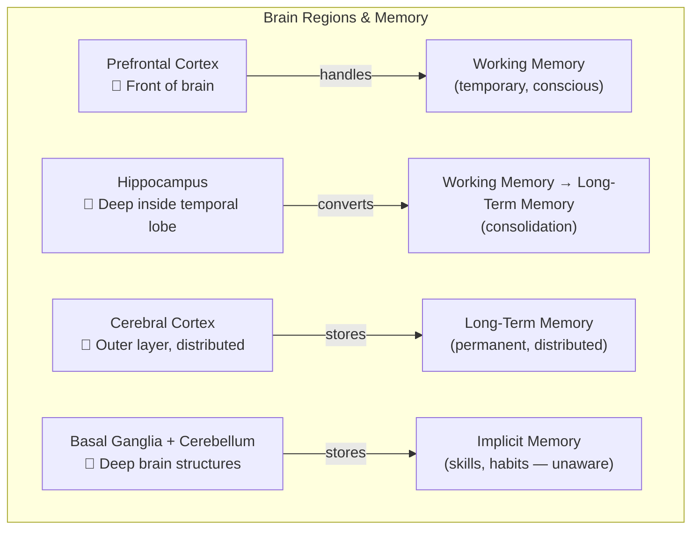

| Brain Region | Memory Role | Damage Consequence |
|-------------|-------------|-------------------|
| **Prefrontal cortex** | Working memory — holds & manipulates current information | Can't focus, can't hold instructions in mind |
| **Hippocampus** | Gateway to long-term memory — consolidates new conscious memories | Can't form **new** long-term memories (but old ones remain!) |
| **Cerebral cortex** (distributed) | Stores long-term declarative memories across many regions | Loss of specific knowledge depending on area damaged |
| **Basal ganglia & cerebellum** | Stores procedural/implicit memories (skills, habits) | Loss of motor skills, coordination |
| **Amygdala** | Tags memories with emotion — emotional memories consolidate faster | Reduced emotional memory, less fear learning |

### The Hippocampus — The Critical Gateway

The hippocampus is essential for **conscious (explicit) memory**. It acts as a temporary relay station:

```
New experience → Prefrontal cortex (working memory)
                      ↓
                 Hippocampus (consolidation — especially during sleep)
                      ↓
                 Cerebral cortex (permanent long-term storage)
```

**Famous case — Patient H.M.:** In 1953, Henry Molaison had his hippocampus surgically removed to treat epilepsy. The result:
- He could **not** form any new conscious memories (no new facts, no new events)
- He **could** still recall old memories from before surgery
- He **could** still learn new motor skills (procedural memory) — proving implicit memory uses a different brain system

This case proved that the hippocampus is required for forming new conscious memories but **not** for implicit/procedural memory (which uses the basal ganglia and cerebellum instead).

### Why This Matters for the ANN Comparison

An ANN has **no physical separation** between these functions. All computation runs through the same weights and layers. The brain's architecture is fundamentally modular — different memory types live in different hardware.

| Brain Architecture | ANN Architecture |
|-------------------|-----------------|
| Prefrontal cortex = working memory processor | Context window = all-purpose buffer |
| Hippocampus = consolidation engine | No equivalent — no ongoing consolidation |
| Cortex = distributed long-term storage | Weights = single unified storage |
| Basal ganglia = implicit memory system | No equivalent — no separate skill system |
| **Specialized regions for specialized memory** | **One architecture does everything** |

---

## Long-Term Memory — The Brain's "Weights"

### What It Is

Long-term memory is where the brain stores knowledge permanently. Unlike working memory, it has **virtually unlimited capacity** and can last a lifetime.

Getting information from working memory into long-term memory requires **consolidation** — and this is where most students fail.

### Two Types

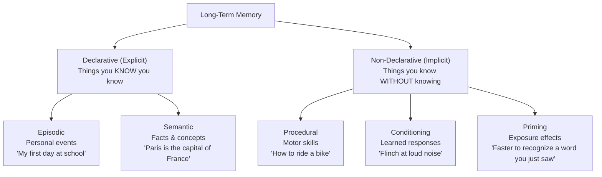

### The ANN Comparison

| Property | Human Long-Term Memory | ANN Weights |
|----------|----------------------|-------------|
| **Capacity** | Virtually unlimited | Fixed at architecture design (number of parameters) |
| **How it's formed** | Repeated activation strengthens synapses (Hebbian learning: "neurons that fire together wire together") | Gradient descent adjusts W to minimize loss |
| **Can update after "deployment"?** | Yes — learning never stops | No — weights frozen after training |
| **Retrieval** | Cue-dependent, associative, sometimes fails | Deterministic forward pass, always produces output |
| **Forgetting** | Yes — Ebbinghaus forgetting curve | No forgetting, but also no new learning |

### Key Insight From Oakley

> "Learning is creating a pattern of neural connections in long-term memory."

The brain's version of "training" is **repeated retrieval and use** of information, which strengthens synaptic connections — directly analogous to how gradient descent strengthens weights along useful pathways.

---

## Unaware Memory — What ANNs Cannot Do

### Procedural (Implicit) Memory

This is the most fascinating difference. Humans have knowledge they **cannot articulate or access consciously**:

- **Drawing skill** — You can draw a face, but you cannot explain the exact muscle movements
- **Riding a bike** — You know how, but try writing instructions for someone who has never done it
- **Native language grammar** — You know "the big red ball" sounds right and "the red big ball" sounds wrong, but most people cannot state the adjective-ordering rule (opinion-size-age-shape-color-origin-material-purpose)
- **Typing** — Look away from the keyboard: where is the letter "J"? Most fast typists cannot answer without moving their fingers

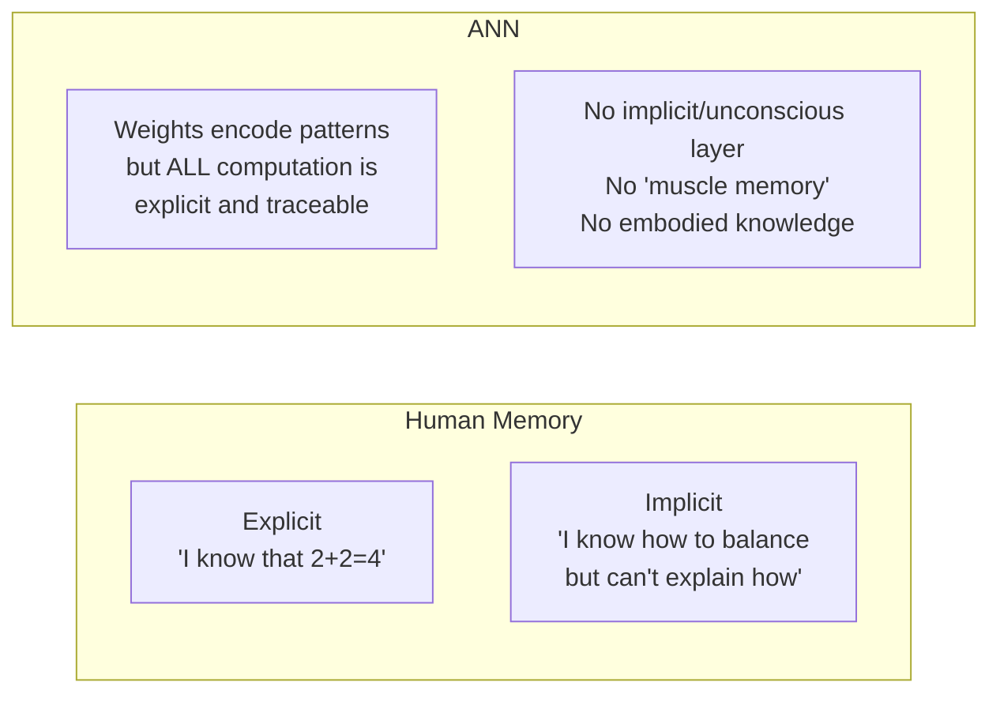

### Why This Matters for Learning

Oakley's key point: **you want to move knowledge from explicit to implicit.** When math operations become automatic (implicit), your working memory is freed for problem-solving. When reading becomes automatic, you can focus on comprehension.

```
Beginner reading:   [decode letter] [decode letter] [form word] [understand word]  → working memory full
Expert reading:     [understand sentence]  → most processing is implicit/automatic
```

This is exactly what an ANN **cannot** do — it has no mechanism to "automate" frequent patterns into a faster subsystem. Every forward pass computes the full chain `W·X + b -> f(z)` through all layers, every time.

### The Science — How Unconscious Memory Actually Works

Unconscious (implicit) memory is one of the most studied topics in cognitive psychology. Here are the landmark experiments and what they revealed:

#### 1. Claparède's Pin-Prick Experiment (1911)

Swiss neurologist Édouard Claparède treated a patient with severe amnesia (damaged hippocampus). Every time he entered the room, she didn't recognize him — he had to re-introduce himself daily.

One day, he **hid a pin in his hand** and pricked her during a handshake. The next day, she still didn't recognize him. But when he extended his hand, **she refused to shake it** — without being able to explain why.

```
Conscious memory (hippocampus):  "Who are you?" → FAILED — no recall
Unconscious memory (amygdala):   "Don't shake hands" → WORKED — emotional conditioning intact
```

**What this proved:** The brain can learn and store fear/avoidance responses **without any conscious awareness**. The amygdala (emotional memory) operates independently of the hippocampus (conscious memory).

#### 2. Patient H.M. — Mirror Drawing (Milner, 1962)

After his hippocampus was removed, Henry Molaison could not form any new conscious memories. Researcher Brenda Milner asked him to trace a star while looking only at a mirror reflection (a difficult motor task).

```
Day 1: Slow, many errors — "I've never done this before"
Day 2: Faster, fewer errors — "I've never done this before"
Day 3: Nearly perfect — "I've never done this before"
```

He **improved every day** but had **zero memory of ever practicing**. His basal ganglia (procedural memory system) was learning normally — only his hippocampus-dependent conscious memory was broken.

**What this proved:** Motor skill learning (procedural memory) uses a **completely separate brain system** from conscious memory. The basal ganglia and cerebellum can learn independently of the hippocampus.

#### 3. Artificial Grammar Learning (Reber, 1967)

Arthur Reber showed participants strings of letters generated by a hidden set of rules (a "grammar"):

```
Training:    MXRVXT, VMTRRR, MXTRRR, VMTRVX ...
Test:        "Is MXRTRVX valid?"  →  Participants answered correctly ~65-70% of the time
Follow-up:   "What are the rules?"  →  Participants could NOT explain them
```

People learned the underlying patterns **without being able to articulate what those patterns were**. This is called **implicit learning** — extracting statistical regularities from experience without conscious awareness.

**What this proved:** The brain has a system for detecting and learning complex patterns that operates **below conscious awareness**. You can "know" a pattern without "knowing" you know it.

> **ANN comparison:** Interestingly, this is the one area where ANNs do something *similar*. An ANN trained on language learns grammar rules encoded in its weights — but the weights are just numbers, not explicit rules. However, the key difference remains: the ANN has no separate "conscious" system that could or couldn't access those rules. It's all one system.

#### 4. Priming — You're Faster Without Knowing Why (Warrington & Weiskrantz, 1968)

Amnesic patients were shown a list of words (e.g., "ELEPHANT"). Later:

```
Explicit test:  "Do you remember seeing any words?"  → "No" (failed — no conscious recall)
Implicit test:  "Complete this word: ELE_____"        → "ELEPHANT" (succeeded — priming intact)
```

The prior exposure made them faster and more likely to produce the word, even though they had **no conscious memory** of seeing it.

**What this proved:** Mere exposure changes future behavior without requiring conscious memory. Priming operates through the **cerebral cortex** (perceptual processing areas), not the hippocampus.

#### 5. The Serial Reaction Time Task (Nissen & Bullemer, 1987)

Participants pressed buttons matching positions on a screen. Unknown to them, the positions followed a repeating 12-item sequence.

```
Block 1-4:   Reaction times get faster (learning the hidden sequence)
Block 5:     Switch to random sequence → reaction times JUMP UP
Question:    "Was there a pattern?" → Most said "No"
```

Their motor system had learned the sequence, but their conscious mind hadn't noticed.

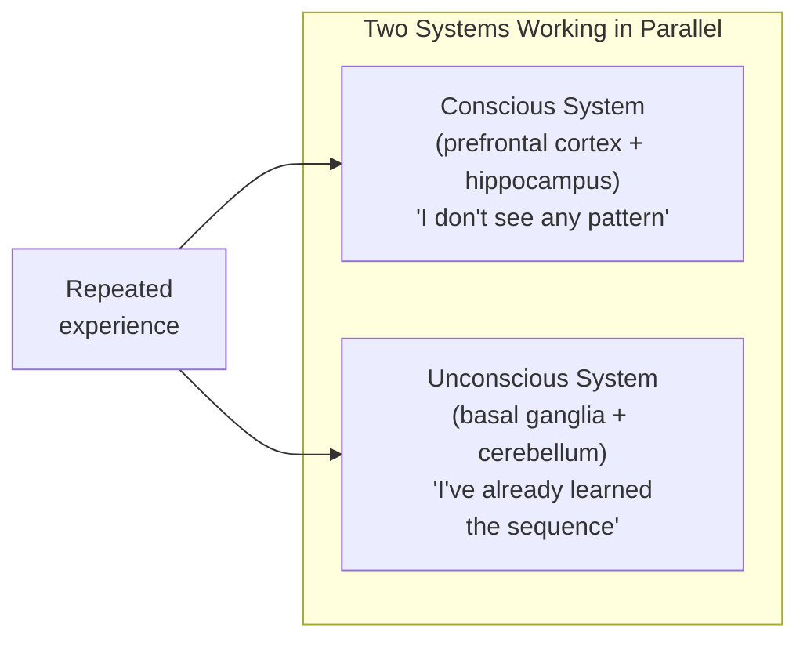

#### How Unconscious Memory Forms — The Mechanism

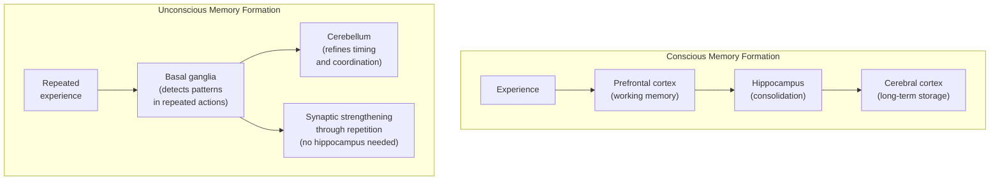

| Property | Conscious Memory | Unconscious Memory |
|----------|-----------------|-------------------|
| **Brain system** | Hippocampus → Cortex | Basal ganglia + Cerebellum |
| **How it forms** | Attention + consolidation (can be 1 trial) | Repetition over many trials (slow, gradual) |
| **Awareness** | You know you know it | You don't know you know it |
| **Speed of learning** | Fast (one exposure can be enough) | Slow (requires many repetitions) |
| **Verbal access** | Can describe it in words | Cannot describe it in words |
| **Damage if hippocampus lost** | Destroyed | **Intact** |
| **Example** | "The capital of France is Paris" | "How to ride a bike" |

#### Why Humans Have Two Separate Systems

Evolutionary theory suggests these systems evolved for **different survival needs**:

- **Conscious memory** = flexible, fast adaptation ("That berry made me sick" — learned in 1 trial)
- **Unconscious memory** = reliable, optimized performance ("Walk without thinking about each step" — learned over thousands of repetitions)

Having both means humans can **respond to novel situations** (conscious) while **efficiently executing practiced routines** (unconscious) simultaneously — like having a conversation while driving.

#### Key Researchers in Unconscious Memory

| Researcher | Contribution | Year |
|-----------|-------------|------|
| **Édouard Claparède** | Pin-prick experiment — fear learning without awareness | 1911 |
| **Brenda Milner** | Patient H.M. — procedural learning survives amnesia | 1962 |
| **Arthur Reber** | Artificial grammar learning — implicit pattern detection | 1967 |
| **Elizabeth Warrington & Lawrence Weiskrantz** | Priming in amnesic patients | 1968 |
| **Mary Jo Nissen & Peter Bullemer** | Serial reaction time — motor sequence learning without awareness | 1987 |
| **Larry Squire** | Taxonomy of memory systems — declarative vs non-declarative | 1992 |
| **Endel Tulving** | Multiple memory systems theory | 1985 |
| **Daniel Schacter** | Implicit memory as a distinct cognitive system | 1987 |

---

## What Reduces Human Memory — The Enemies of Learning

Before looking at how to improve memory, it's worth understanding what **damages or blocks** it. These are backed by research in cognitive psychology and neuroscience.

### 1. Sleep Deprivation — The #1 Memory Killer

Oakley calls this the most common mistake students make. Research by Matthew Walker (*Why We Sleep*, 2017) shows:

```
One night of poor sleep (<6 hours):
  → 40% reduction in ability to form new memories (Walker, 2007)
  → Hippocampus activity drops significantly
  → Working memory capacity shrinks
```

**Why:** The hippocampus consolidates memories **during sleep** (especially slow-wave sleep). Skip sleep = skip consolidation = memories never make it to long-term storage.

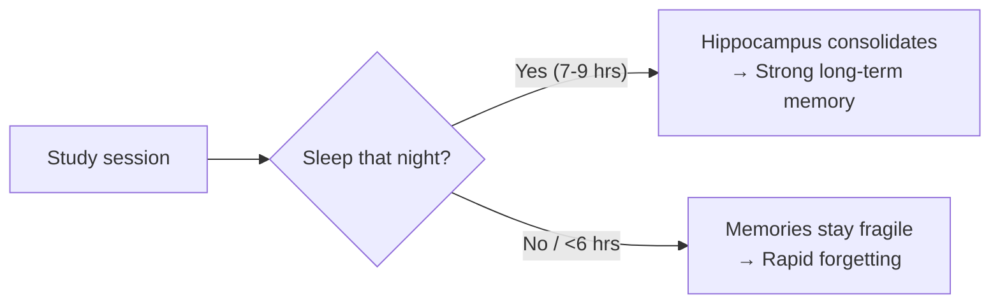

The cruel irony: students sacrifice sleep to study more, but the lost sleep **destroys** what they studied.

### 2. Chronic Stress — Cortisol Destroys the Hippocampus

Short bursts of stress can actually **help** memory (adrenaline + cortisol tag experiences as important). But **chronic stress** is toxic:

```
Acute stress (minutes):   Cortisol → Amygdala → "Remember this!" → ENHANCED memory
Chronic stress (weeks):   Cortisol → Hippocampus → Neuron damage → IMPAIRED memory
```

Research by Robert Sapolsky (Stanford) showed that prolonged cortisol exposure:
- **Shrinks the hippocampus** — literally reduces its volume (Sapolsky, 1996)
- **Kills hippocampal neurons** — the cells that form new conscious memories
- **Impairs working memory** — prefrontal cortex is also sensitive to cortisol
- **Blocks long-term potentiation (LTP)** — the cellular mechanism of memory formation

| Stress Type | Duration | Effect on Memory |
|------------|----------|-----------------|
| **Acute** (exam pressure) | Minutes to hours | Can enhance memory (adrenaline helps encoding) |
| **Chronic** (ongoing anxiety, family problems) | Weeks to months | Damages hippocampus, impairs all memory formation |
| **Traumatic** (PTSD) | Single event, lasting impact | Overactive amygdala (flashbacks), impaired hippocampus (fragmented recall) |

### 3. Multitasking — The Illusion of Efficiency

Research by Russell Poldrack (UCLA, 2006) used brain imaging to show what happens when you study while distracted:

```
Focused study:        Information → Hippocampus → Declarative memory (flexible, recallable)
Distracted study:     Information → Striatum → Habit memory (rigid, less useful)
```

**The brain literally routes information to a different memory system when you're distracted.** You still "learn" something, but it goes to the striatum (habit system) instead of the hippocampus (flexible knowledge system). The result: you can recognize the information but can't apply it flexibly.

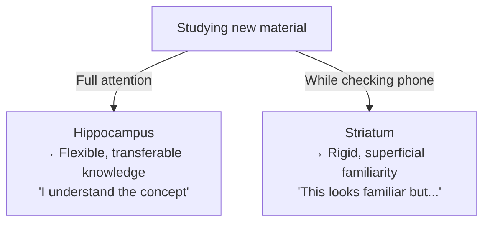

### 4. The Illusion of Competence — Re-reading & Highlighting

Oakley specifically warns about this. Research by Karpicke & Blunt (2011):

```
Students were divided into groups:
  Group A: Re-read the material 4 times
  Group B: Read once, then did active recall

Result: Group B significantly outperformed Group A on a test one week later
         Group A OVERESTIMATED how well they would perform
```

**Why re-reading is harmful:** It creates **fluency** — the material feels familiar, which your brain misinterprets as "I know this." But recognition is not recall. You feel confident but actually haven't encoded the material into retrievable memory.

| Feels Like Learning | Actually Is Learning |
|--------------------|---------------------|
| Re-reading highlighted text | Closing the book and recalling from memory |
| Watching a tutorial video | Trying to solve the problem yourself first |
| Copying someone's notes | Writing a summary in your own words |
| Recognizing the answer on a multiple-choice test | Producing the answer from a blank page |

### 5. Alcohol — Direct Hippocampal Damage

Even moderate alcohol consumption impairs memory formation:

- **Acute:** Alcohol blocks NMDA receptors in the hippocampus, preventing long-term potentiation (the cellular mechanism of memory). This is why "blackouts" happen — the hippocampus literally stops recording.
- **Chronic:** Prolonged heavy drinking causes thiamine (B1) deficiency, which can lead to **Korsakoff's syndrome** — permanent, severe amnesia due to hippocampal and thalamic damage.

### 6. Lack of Exercise — Missing the Brain's Fertilizer

Research by Hillman, Erickson & Kramer (2008) shows:

```
Exercise → increases BDNF (Brain-Derived Neurotrophic Factor)
BDNF → promotes growth of new neurons in the hippocampus (neurogenesis)
No exercise → lower BDNF → fewer new neurons → weaker memory formation
```

Exercise is one of the **only proven ways** to grow new neurons in the adult hippocampus. Sedentary lifestyle removes this benefit.

### 7. Digital Dependence — Outsourcing Memory

The "Google Effect" (Sparrow et al., 2011): when people **expect** to have access to information later (via search engine, phone, notes app), they encode it **less strongly** in the first place.

```
"I'll just look it up later" → Brain invests less effort in encoding → Weaker memory trace
```

This isn't about technology being bad — it's about the brain being efficient. If it thinks information is available externally, it won't waste energy storing it internally.

### Summary — What Hurts Memory vs What Helps

```mermaid
graph TB
    subgraph "Memory Killers ✗"
        direction TB
        K1["Sleep deprivation<br/>(blocks consolidation)"]
        K2["Chronic stress<br/>(damages hippocampus)"]
        K3["Multitasking<br/>(routes to wrong system)"]
        K4["Re-reading / highlighting<br/>(illusion of competence)"]
        K5["Alcohol<br/>(blocks LTP)"]
        K6["No exercise<br/>(less BDNF, less neurogenesis)"]
        K7["Digital dependence<br/>(reduced encoding effort)"]
    end
    
    subgraph "Memory Builders ✓"
        direction TB
        B1["Sleep 7-9 hrs<br/>(consolidation)"]
        B2["Manage stress<br/>(protect hippocampus)"]
        B3["Single-task focus<br/>(hippocampal encoding)"]
        B4["Active recall<br/>(strengthens retrieval)"]
        B5["Moderate caffeine<br/>(blocks adenosine)"]
        B6["Regular exercise<br/>(increases BDNF)"]
        B7["Spaced practice<br/>(fights forgetting curve)"]
    end
```

> **ANN comparison:** ANNs have none of these vulnerabilities — they don't sleep, stress, or get distracted. But they also can't benefit from exercise, emotion, or rest. The human memory system's weaknesses are the **flip side of its strengths**: it's a living, adaptive system that requires maintenance. An ANN is a static system that requires nothing but electricity — but also cannot grow.

---

## How to Improve Human Memory — Oakley's Strategies

### 1. Transform It (Encoding)

Don't just re-read. **Transform** information into a different form. This forces deeper processing.

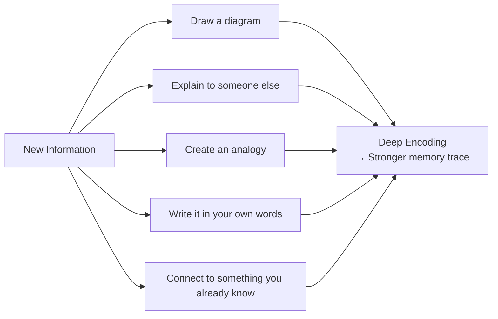

**Why it works:** Transformation activates multiple brain regions (visual, verbal, motor, emotional), creating more synaptic connections to the same memory. More connections = more retrieval cues = easier to remember.

| Weak Encoding | Strong Encoding |
|---------------|-----------------|
| Re-reading the textbook | Closing the book and drawing a concept map |
| Highlighting text | Writing a summary in your own words |
| Copying notes | Teaching the concept to a friend |
| Passive listening | Creating practice problems |

> **ANN analogy:** This is like data augmentation in training — showing the network the same concept from multiple angles (rotated images, paraphrased text) creates more robust weight patterns. The human version is self-directed.

### 2. Drink a Cup of Coffee (Arousal & Attention)

This one sounds trivial but has solid neuroscience behind it.

**Caffeine** blocks adenosine receptors in the brain. Adenosine normally accumulates during waking hours and makes you drowsy. Blocking it:

```
Caffeine → blocks adenosine → increases alertness
                             → improves attention
                             → enhances working memory capacity (slightly)
                             → better consolidation of new memories
```

**Optimal use (from research):**
- **200mg** (about 1 cup of brewed coffee) is the sweet spot
- **Timing matters**: drink it **during or right after** a study session, not before sleep
- Caffeine enhances **consolidation** — the process of moving info from working memory to long-term memory
- Diminishing returns: regular heavy use reduces the effect (tolerance)

> **ANN analogy:** There isn't a direct one, but the closest concept is **learning rate**. Too low (drowsy brain) and learning is slow. Too high (too much caffeine/anxiety) and you overshoot — you can't focus, you jitter. There's an optimal arousal level (Yerkes-Dodson law).

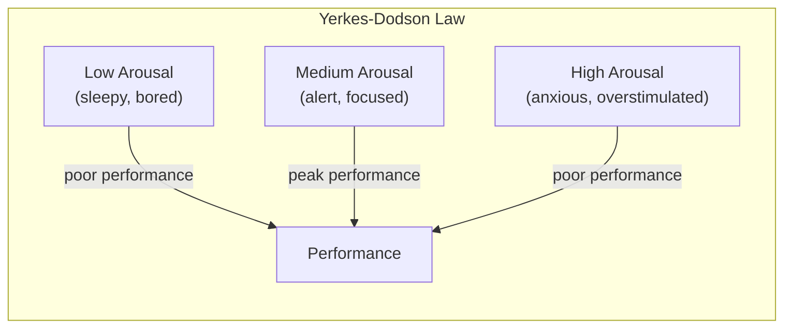

### 3. Recall (Active Retrieval Practice)

This is Oakley's **most important** strategy. It's also the most counterintuitive.

**The testing effect:** Actively trying to retrieve information from memory strengthens the memory far more than re-studying the material.

```
Re-reading:     Information → Eyes → Short-term buffer → fades
Active recall:  [Close book] → Try to remember → Struggle → Retrieve → STRONGER memory
```

**Why struggling matters:** When you try to recall and it's **hard**, the brain strengthens that retrieval pathway. Easy recall doesn't trigger the same consolidation. This is called **desirable difficulty**.

**Practical techniques:**
1. **Flashcards** — The classic. Flip, try to answer, check.
2. **Blank page method** — After reading a section, close the book. Write everything you remember on a blank page.
3. **Self-testing** — Before looking at solutions, try to solve the problem yourself.
4. **Spaced retrieval** — Test yourself at increasing intervals (1 day, 3 days, 7 days, 14 days).

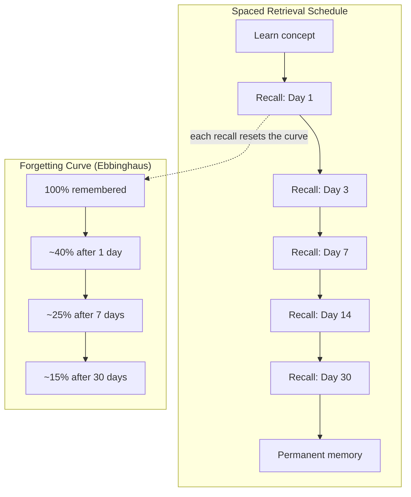

> **ANN analogy:** Active recall is like **training epochs**. The ANN doesn't learn by being shown data passively — it learns by making predictions (forward pass), checking errors (loss), and updating (backprop). Each recall attempt is the brain's version of a training step. Re-reading is like feeding data through a network with a learning rate of zero — the data passes through but nothing changes.

---

## Oakley's Two Modes of Thinking

A central concept in *Learning How to Learn*:

### Focused Mode vs Diffuse Mode

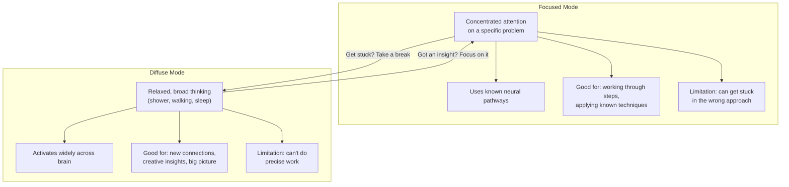

| Property | Focused Mode | Diffuse Mode |
|----------|-------------|-------------|
| **Attention** | Narrow, concentrated | Wide, relaxed |
| **When active** | Studying, problem-solving | Walking, showering, sleeping |
| **Neural activity** | Tight, established pathways | Broad, random connections |
| **Good for** | Executing known methods | Finding new approaches |
| **Analogy** | Pinball with tight bumpers | Pinball with wide bumpers |

**Oakley's advice:** Alternate between the two. Study hard (focused), then take a break or sleep (diffuse). The breakthrough often comes during the diffuse phase.

### The ANN Comparison

ANNs have **no diffuse mode**. They are always in "focused mode" — running the same computation path through fixed weights. This is why:

- ANNs don't have "aha moments"
- ANNs can't step back and reconsider their approach mid-computation
- ANNs don't benefit from "sleeping on it" (though there's a technique called **dropout** during training that vaguely mimics some diffuse-mode properties by randomly deactivating neurons)

---

## Sleep — The Brain's Training Phase

Oakley emphasizes sleep as non-negotiable for learning.

### What Happens During Sleep

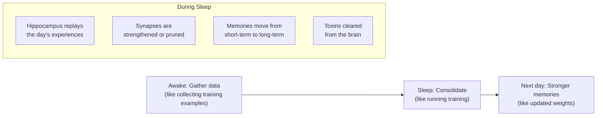

| Sleep Phase | What It Does | ANN Analogy |
|-------------|-------------|-------------|
| **Slow-wave sleep** | Consolidates declarative memories (facts) | Training on a dataset |
| **REM sleep** | Strengthens procedural memories (skills), creates creative connections | Fine-tuning + data augmentation |
| **Sleep spindles** | Transfer from hippocampus to cortex | Moving data from buffer to permanent storage |

> **This is the biggest difference from ANNs.** The brain does its actual "weight updating" (synaptic strengthening) primarily during sleep. An ANN trains in one continuous session. A human learns across cycles of experience and rest.

---

## Summary — Human Brain vs ANN Memory

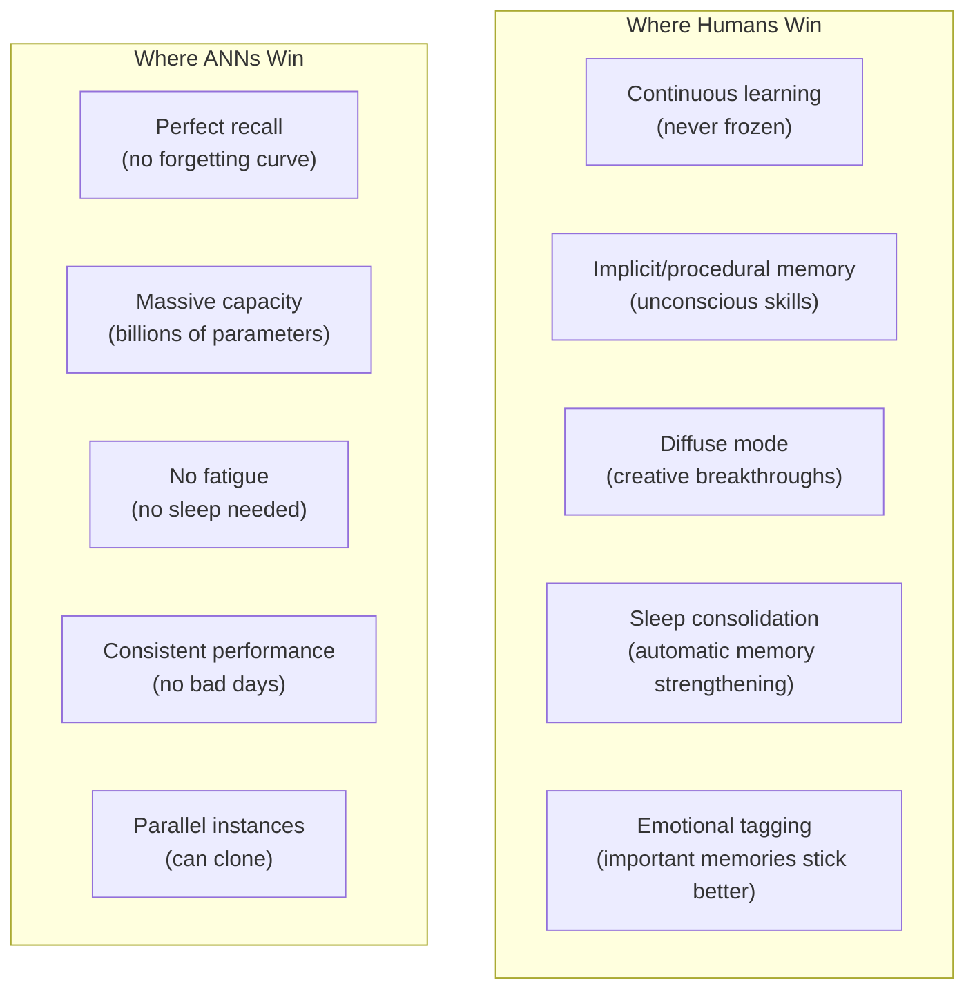

### Oakley's Core Message for Students

1. **Don't just re-read** — use active recall (the brain's version of training)
2. **Chunk information** — compress multiple items into single units (the brain's version of learned representations)
3. **Sleep** — your brain literally trains during sleep (the brain's offline training phase)
4. **Alternate focused and diffuse** — your brain has two modes; use both (ANNs only have one)
5. **Transform information** — encode through multiple channels (the brain's version of data augmentation)
6. **Space your practice** — distributed practice beats cramming (the brain's version of multiple training epochs with different data ordering)
7. **Coffee helps** — moderate caffeine improves attention and consolidation (the brain's learning rate optimizer)

---

## References

- Oakley, B. (2018). *Learning How to Learn: How to Succeed in School Without Spending All Your Time Studying; A Guide for Kids and Teens*. TarcherPerigee.
- Oakley, B. (2014). *A Mind for Numbers: How to Excel at Math and Science*. TarcherPerigee.
- Ebbinghaus, H. (1885). *Memory: A Contribution to Experimental Psychology*.
- Cowan, N. (2001). "The magical number 4 in short-term memory." *Behavioral and Brain Sciences*.
- Roediger, H. L., & Butler, A. C. (2011). "The critical role of retrieval practice in long-term retention." *Trends in Cognitive Sciences*.
- Yerkes, R. M., & Dodson, J. D. (1908). "The relation of strength of stimulus to rapidity of habit-formation."
